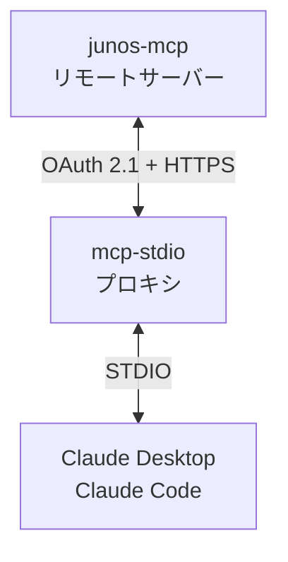

# junos-mcp

[English](README.md) | 日本語

[junos-ops](https://github.com/shigechika/junos-ops) 用の MCP (Model Context Protocol) サーバーです。

Juniper Networks デバイスの操作を、MCP 対応の AI アシスタント（Claude Desktop、Claude Code など）から利用できるようにします。STDIO トランスポートを使用します。
[junos-ops](https://github.com/shigechika/junos-ops) が人間向けの CLI ツールであるのに対し、**junos-mcp** は同じエンジンの AI 向けインターフェースです。

## 機能

### デバイス情報

| ツール | 説明 | 接続 |
|--------|------|:----:|
| `get_device_facts` | デバイス基本情報の取得（モデル、ホスト名、シリアル番号、バージョン） | 要 |
| `get_version` | JUNOS バージョン情報の表示（アップグレード状況付き） | 要 |
| `get_router_list` | config.ini に定義されたルータの一覧表示（タグでフィルタ可） | 不要 |

### CLI コマンド実行

| ツール | 説明 | 接続 |
|--------|------|:----:|
| `run_show_command` | 単一の CLI show コマンドの実行 | 要 |
| `run_show_commands` | 複数の CLI コマンドを1セッションで順次実行 | 要 |
| `run_show_command_batch` | 複数デバイスに対してコマンドを並列実行（タグフィルタ・`grep_pattern` 対応） | 要 |

### 設定管理

| ツール | 説明 | 接続 |
|--------|------|:----:|
| `get_config` | デバイス設定の取得（text/set/xml 形式） | 要 |
| `get_config_diff` | rollback バージョンとの設定差分表示 | 要 |
| `push_config` | commit confirmed + ヘルスチェック付きの設定投入 | 要 |

### アップグレード操作

| ツール | 説明 | 接続 |
|--------|------|:----:|
| `check_upgrade_readiness` | アップグレード準備状況の確認 | 要 |
| `compare_version` | 2 つの JUNOS バージョン文字列の比較 | 不要 |
| `get_package_info` | モデル別パッケージファイル名とハッシュの取得 | 不要 |
| `list_remote_files` | リモートデバイスのファイル一覧表示 | 要 |
| `copy_package` | SCP によるファームウェアパッケージのコピー（チェックサム検証付き） | 要 |
| `install_package` | プリフライトチェック付きのファームウェアインストール | 要 |
| `rollback_package` | 前バージョンへのパッケージロールバック | 要 |
| `schedule_reboot` | 指定時刻でのリブートスケジュール | 要 |

### 診断

| ツール | 説明 | 接続 |
|--------|------|:----:|
| `collect_rsi` | モデル別タイムアウト付きの RSI/SCF 収集 | 要 |
| `collect_rsi_batch` | 複数デバイスからの RSI/SCF 並列収集（タグでフィルタ可） | 要 |

### プリフライトチェック

`junos-ops check` サブコマンドの 3 モードに対応します。テーブル整形は junos-ops の display 層を共有します。

| ツール | 説明 | 接続 |
|--------|------|:----:|
| `check_reachability` | NETCONF 到達性のみを高速確認（facts 取得なし、5 秒 TCP プローブ） | 要 |
| `check_local_inventory` | config.ini のインベントリに対してローカルファームウェアのチェックサムを検証 | 不要 |
| `check_remote_packages` | デバイス上の配置済みファームウェアのチェックサムを検証（SCP コピー後の検証にも） | 要 |

### 安全設計

すべての破壊的操作（`push_config`、`copy_package`、`install_package`、`rollback_package`、`schedule_reboot`）は **dry-run モードがデフォルト**（`dry_run=True`）です。AI アシスタントが変更を実行するには、明示的に `dry_run=False` を指定する必要があります。

`push_config` は他の Junos MCP サーバーにはない安全機能を提供します:

- **commit confirmed** — タイムアウト付き（確認されなければ自動ロールバック）
- **フォールバック付きヘルスチェック** — commit 後に ping、NETCONF uptime プローブ、または任意の CLI コマンドで確認
- **自動ロールバック** — ヘルスチェック失敗時に commit を確認せず、タイマー満了で自動ロールバック

## 必要要件

- Python 3.12 以上
- [junos-ops](https://github.com/shigechika/junos-ops) と有効な `config.ini`
- [MCP Python SDK](https://github.com/modelcontextprotocol/python-sdk) >= 1.0

## インストール

```bash
pip install junos-mcp
```

開発用:

```bash
git clone https://github.com/shigechika/junos-mcp.git
cd junos-mcp
python3 -m venv .venv
. .venv/bin/activate
pip install -e ".[test]"
```

## CLI オプション

```bash
python -m junos_mcp --help
```

| オプション | 説明 |
|------------|------|
| `-V`, `--version` | バージョンを表示して終了 |
| `--check` | config.ini を読み込みルータ一覧を表示して終了（エラー時 exit 1） |
| `--check-host HOSTNAME` | `--check` と併用し、指定ホストに NETCONF 接続して到達性と認証を確認 |
| `--transport {stdio,streamable-http}` | トランスポート（デフォルト: `stdio`） |

`--check` は AI アシスタントに登録する前に `JUNOS_OPS_CONFIG` と `config.ini` の到達性を確認するのに便利です。`--check-host rt1` と併用すれば、実機に対して認証情報が通るかまで検証できます。

## タグによるホスト絞り込み

`run_show_command_batch`、`collect_rsi_batch`、`get_router_list` は `tags` 引数を受け付けます。文法は `junos-ops --tags` CLI フラグと同一です（junos-mcp 0.9.0 / junos-ops 0.16.6 以降）。

- リストの各要素が **1 つのタググループ**。グループ内のカンマ区切りタグは **AND** で結合。
- リスト要素同士は **OR** で結合。
- バッチ系ツールで `hostnames` と併用した場合は **積集合**（タグで絞った中からさらに名前で絞り込み）。積集合が空ならエラーを返します。

```python
# 1 グループ・1 タグ — "main" タグを持つホスト
run_show_command_batch(command="show route summary", tags=["main"])

# 1 グループ・2 タグ — グループ内 AND: tokyo AND edge
collect_rsi_batch(tags=["tokyo,edge"])

# 2 グループ — グループ間 OR: main OR backup
get_router_list(tags=["main", "backup"])

# 混在: (tokyo AND core) OR backup
run_show_command_batch(command="show version", tags=["tokyo,core", "backup"])

# 積集合: backup タグを持つホストのうち rt1 / rt2 のみ
run_show_command_batch(
    command="show version",
    hostnames=["rt1.example.jp", "rt2.example.jp"],
    tags=["backup"],
)
```

`config.ini` へのタグ付け方法と CLI 側の同文法については [junos-ops のタグドキュメント](https://github.com/shigechika/junos-ops#tag-based-host-filtering) を参照してください。

## サーバーサイド出力フィルタ

`run_show_command_batch` はオプションの `grep_pattern` 引数（Python `re` パターン）を受け付けます。指定すると、各ホストの出力からパターンにマッチした行のみが残ります。`#` で始まるヘッダー行は常に保持されます。マッチする行がないホストには `(no match)` が表示されます。

大規模なバッチ結果（例: 93 台 × `show route summary`）を数百 KB から数百バイトに削減し、tool-results ファイルへの書き出しなしでインラインで扱えるようになります:

```python
# 93 台のルータから inet.0 の宛先数のみを抽出
run_show_command_batch(
    command="show route summary",
    tags=["main"],
    grep_pattern=r"inet\.0:\s+\d+ destinations",
)
```

## 接続プール

junos-mcp はホストごとに NETCONF 接続をプールします。アイドル状態の `Device` を再利用することで、ツール呼び出しのたびに TCP/NETCONF ハンドシェイクが発生しなくなります。同一ホストへの並行操作はホスト単位のロックでシリアライズされます。

| 環境変数 | デフォルト | 説明 |
|----------|-----------|------|
| `JUNOS_MCP_POOL` | `1`（有効） | `0` にするとプールを無効化し、呼び出しごとに新規接続を開く |
| `JUNOS_MCP_POOL_IDLE` | `60` | アイドルタイムアウト（秒）。この時間以上使われなかった接続は次回の呼び出し時に閉じて再接続する。`0` でアイドル退場を無効化 |

**セキュリティ上の注意:** プール内の接続は長寿命の SSH セッションです。ポリシーでセッション継続時間が制限されている環境では、`JUNOS_MCP_POOL_IDLE` をその制限時間より短い値に設定するか、`JUNOS_MCP_POOL=0` でプールを無効にしてください。

## 設定

junos-ops と同じ `config.ini` を使用します。詳細は [junos-ops README](https://github.com/shigechika/junos-ops) を参照してください。

各ツールはオプションの `config_path` パラメータを受け付けます。省略時は以下の順序で探索します:
1. 環境変数 `JUNOS_OPS_CONFIG`
2. `./config.ini`
3. `~/.config/junos-ops/config.ini`

## 使い方

### Claude Code

`claude mcp add` コマンドで MCP サーバーを登録します:

```bash
claude mcp add junos-mcp \
  -e JUNOS_OPS_CONFIG=~/.config/junos-ops/config.ini \
  -- python -m junos_mcp
```

`--scope`（`-s`）オプションで設定の保存先を選択できます:

| スコープ | 説明 | 保存先 |
|----------|------|--------|
| `local`（デフォルト） | 現在のプロジェクト、自分のみ | `~/.claude.json` |
| `project` | 現在のプロジェクト、チームで共有 | プロジェクトルートの `.mcp.json` |
| `user` | 全プロジェクト、自分のみ | `~/.claude.json` |

### Claude Desktop

Claude Desktop の設定ファイルに追加します:

| OS | 設定ファイル |
|----|-------------|
| macOS | `~/Library/Application Support/Claude/claude_desktop_config.json` |
| Windows | `%APPDATA%\Claude\claude_desktop_config.json` |
| Linux | `~/.config/Claude/claude_desktop_config.json` |

```json
{
  "mcpServers": {
    "junos-mcp": {
      "command": "python",
      "args": ["-m", "junos_mcp"],
      "env": {
        "JUNOS_OPS_CONFIG": "/path/to/config.ini"
      }
    }
  }
}
```

設定変更後は Claude Desktop を再起動してください。

### リモートアクセス（OAuth 対応、mcp-stdio 経由）

junos-mcp は Streamable HTTP トランスポートに対応しており、
[mcp-stdio](https://github.com/shigechika/mcp-stdio) を OAuth プロキシとして使うことで
Claude Desktop や Claude Code からリモートアクセスできます。



**手順 1: リモートサーバーで junos-mcp を Streamable HTTP で起動**

```bash
JUNOS_OPS_CONFIG=~/.config/junos-ops/config.ini \
  python -m junos_mcp --transport streamable-http
```

デフォルトで `http://localhost:8000/mcp` でリッスンします。

**手順 2: ローカルマシンで mcp-stdio を MCP サーバーとして登録**

```bash
claude mcp add junos-mcp -- mcp-stdio https://your-server:8000/mcp
```

mcp-stdio が OAuth 2.1 認証（RFC 8414 ディスカバリ、RFC 7591 動的クライアント登録、PKCE）を処理し、STDIO ↔ Streamable HTTP を中継します。

OAuth プロバイダの設定を含む詳細は [mcp-stdio README](https://github.com/shigechika/mcp-stdio) を参照してください。

### MCP Inspector（開発用）

```bash
mcp dev junos_mcp/server.py
```

## テスト

```bash
pytest tests/ -v
```

22 ツール、接続プール、ヘルパー関数、エッジケースをカバーする 94 テスト。

## アーキテクチャ

### stdout 安全設計

junos-ops 0.14.1 以降、コア関数は構造化された `dict` を返し stdout に出力しません。MCP ツールは `junos_ops.display.format_*()` で結果を文字列化して返します。`contextlib.redirect_stdout` は不要で、MCP STDIO の JSON-RPC 通信が汚染されません。

### グローバル状態の初期化

junos-ops は `common.args` と `common.config` をグローバル変数として使用します。MCP サーバーは junos-ops のテストフィクスチャ（`conftest.py`）と同じパターンでこれらを初期化します。

### 並列実行

バッチ系ツール（`run_show_command_batch`、`collect_rsi_batch`）は junos-ops の `common.run_parallel()`（`ThreadPoolExecutor`）を使用し、`max_workers` で並列度を制御できます。

## ライセンス

Apache License 2.0
