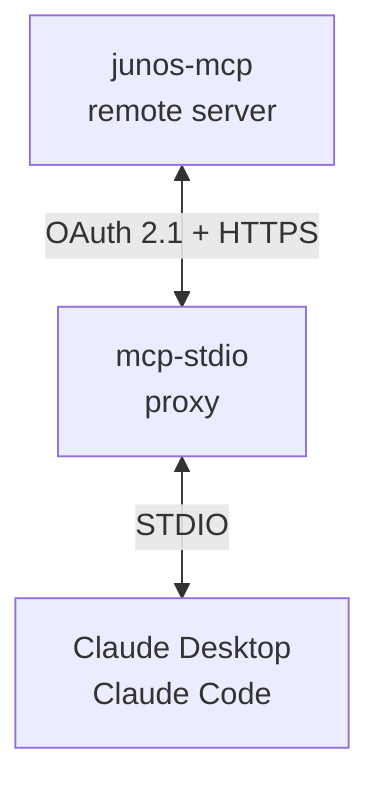

<!-- mcp-name: io.github.shigechika/junos-mcp -->

# junos-mcp

English | [日本語](README.ja.md)

MCP (Model Context Protocol) server for [junos-ops](https://github.com/shigechika/junos-ops).

Exposes Juniper Networks device operations to MCP-compatible AI assistants
(Claude Desktop, Claude Code, etc.) via STDIO transport.
While [junos-ops](https://github.com/shigechika/junos-ops) is the CLI tool for humans,
**junos-mcp** is the AI-facing interface to the same powerful engine.

## Features

### Device Information

| Tool | Description | Connection |
|------|-------------|:----------:|
| `get_device_facts` | Get basic device information (model, hostname, serial, version) | Yes |
| `get_version` | Get JUNOS version with upgrade status | Yes |
| `get_router_list` | List routers from config.ini (optionally filtered by tags) | No |

### CLI Command Execution

| Tool | Description | Connection |
|------|-------------|:----------:|
| `run_show_command` | Run a single CLI show command | Yes |
| `run_show_commands` | Run multiple CLI commands in a single session | Yes |
| `run_show_command_batch` | Run a command on multiple devices in parallel (supports tag filter) | Yes |

### Configuration Management

| Tool | Description | Connection |
|------|-------------|:----------:|
| `get_config` | Get device configuration (text/set/xml format) | Yes |
| `get_config_diff` | Show config diff against a rollback version | Yes |
| `push_config` | Push config with commit confirmed + health check | Yes |

### Upgrade Operations

| Tool | Description | Connection |
|------|-------------|:----------:|
| `check_upgrade_readiness` | Check if device is ready for upgrade | Yes |
| `compare_version` | Compare two JUNOS version strings | No |
| `get_package_info` | Get model-specific package file and hash | No |
| `list_remote_files` | List files on remote device path | Yes |
| `copy_package` | Copy firmware package via SCP with checksum | Yes |
| `install_package` | Install firmware with pre-flight checks | Yes |
| `rollback_package` | Rollback to previous package version | Yes |
| `schedule_reboot` | Schedule device reboot at specified time | Yes |

### Diagnostics

| Tool | Description | Connection |
|------|-------------|:----------:|
| `collect_rsi` | Collect RSI/SCF with model-specific timeouts | Yes |
| `collect_rsi_batch` | Collect RSI/SCF from multiple devices in parallel (supports tag filter) | Yes |

### Pre-flight Checks

Equivalent to the `junos-ops check` subcommand modes. All three reuse the
junos-ops display layer for table rendering.

| Tool | Description | Connection |
|------|-------------|:----------:|
| `check_reachability` | Probe NETCONF reachability per host (fast: no facts, 5s TCP probe) | Yes |
| `check_local_inventory` | Verify local firmware checksums against config.ini inventory | No |
| `check_remote_packages` | Verify staged firmware checksum on devices (post-SCP verification) | Yes |

### Safety by Design

All destructive operations (`push_config`, `copy_package`, `install_package`,
`rollback_package`, `schedule_reboot`) default to **dry-run mode** (`dry_run=True`).
The AI assistant must explicitly set `dry_run=False` to make changes.

`push_config` provides additional safety features not found in other Junos MCP servers:

- **commit confirmed** with configurable timeout (auto-rollback if not confirmed)
- **Fallback health check** after commit (ping, NETCONF uptime probe, or any CLI command)
- **Automatic rollback** if health check fails (commit is not confirmed, timer expires)

## Requirements

- Python 3.12+
- [junos-ops](https://github.com/shigechika/junos-ops) with a valid `config.ini`
- [MCP Python SDK](https://github.com/modelcontextprotocol/python-sdk) >= 1.0

## Installation

```bash
pip install junos-mcp
```

Or for development:

```bash
git clone https://github.com/shigechika/junos-mcp.git
cd junos-mcp
python3 -m venv .venv
. .venv/bin/activate
pip install -e ".[test]"
```

## CLI options

```bash
python -m junos_mcp --help
```

| Option | Description |
|--------|-------------|
| `-V`, `--version` | Print version and exit |
| `--check` | Load config.ini, list routers, and exit (exit code 1 on error) |
| `--check-host HOSTNAME` | With `--check`, also open a NETCONF session to verify reachability/auth |
| `--transport {stdio,streamable-http}` | Transport protocol (default: `stdio`) |

`--check` is handy to verify `JUNOS_OPS_CONFIG` and `config.ini` are reachable before registering the server with an AI assistant. Combine with `--check-host rt1` to also confirm that credentials actually authenticate against a real device.

## Tag-based host filtering

`run_show_command_batch`, `collect_rsi_batch`, and `get_router_list` accept an optional `tags` argument. The grammar matches the `junos-ops --tags` CLI flag (since junos-mcp 0.9.0 / junos-ops 0.16.6):

- Each list element is **one tag group**. Comma-separated tags inside a group **AND** together.
- Multiple list elements **OR** together across groups.
- When combined with `hostnames` on batch tools, the result is the **intersection** (tags filter further narrowed by names). An empty intersection returns an error.

```python
# 1 group, 1 tag — hosts tagged "main"
run_show_command_batch(command="show route summary", tags=["main"])

# 1 group, 2 tags — AND within the group: tokyo AND edge
collect_rsi_batch(tags=["tokyo,edge"])

# 2 groups — OR across groups: main OR backup
get_router_list(tags=["main", "backup"])

# Mixed: (tokyo AND core) OR backup
run_show_command_batch(command="show version", tags=["tokyo,core", "backup"])

# Intersection: among backup-tagged hosts, only rt1/rt2
run_show_command_batch(
    command="show version",
    hostnames=["rt1.example.jp", "rt2.example.jp"],
    tags=["backup"],
)
```

See the [junos-ops tag documentation](https://github.com/shigechika/junos-ops#tag-based-host-filtering) for how to tag sections in `config.ini` and for the matching CLI grammar.

## Configuration

This server uses the same `config.ini` as junos-ops. See [junos-ops README](https://github.com/shigechika/junos-ops) for details.

Each tool accepts an optional `config_path` parameter. If omitted, the default search order is used:
1. Environment variable `JUNOS_OPS_CONFIG`
2. `./config.ini`
3. `~/.config/junos-ops/config.ini`

## Usage

### Claude Code

Register the MCP server with `claude mcp add`:

```bash
claude mcp add junos-mcp \
  -e JUNOS_OPS_CONFIG=~/.config/junos-ops/config.ini \
  -- python -m junos_mcp
```

The `--scope` (`-s`) option controls where the configuration is stored:

| Scope | Description | Config location |
|-------|-------------|-----------------|
| `local` (default) | Current project, current user only | `~/.claude.json` |
| `project` | Current project, shared with team | `.mcp.json` in project root |
| `user` | All projects, current user only | `~/.claude.json` |

### Claude Desktop

Add to Claude Desktop config file:

| OS | Config file |
|----|-------------|
| macOS | `~/Library/Application Support/Claude/claude_desktop_config.json` |
| Windows | `%APPDATA%\Claude\claude_desktop_config.json` |
| Linux | `~/.config/Claude/claude_desktop_config.json` |

```json
{
  "mcpServers": {
    "junos-mcp": {
      "command": "python",
      "args": ["-m", "junos_mcp"],
      "env": {
        "JUNOS_OPS_CONFIG": "/path/to/config.ini"
      }
    }
  }
}
```

Restart Claude Desktop after editing.

### Remote Access with OAuth (via mcp-stdio)

junos-mcp supports Streamable HTTP transport, enabling remote access
from Claude Desktop or Claude Code through
[mcp-stdio](https://github.com/shigechika/mcp-stdio) as an OAuth proxy.



**Step 1: Start junos-mcp with Streamable HTTP on the remote server**

```bash
JUNOS_OPS_CONFIG=~/.config/junos-ops/config.ini \
  python -m junos_mcp --transport streamable-http
```

The server listens on `http://localhost:8000/mcp` by default.

**Step 2: Register mcp-stdio as the MCP server on your local machine**

```bash
claude mcp add junos-mcp -- mcp-stdio https://your-server:8000/mcp
```

mcp-stdio handles OAuth 2.1 authentication (RFC 8414 discovery, RFC 7591
dynamic client registration, PKCE) and relays STDIO ↔ Streamable HTTP.

See [mcp-stdio README](https://github.com/shigechika/mcp-stdio) for
detailed configuration including OAuth provider setup.

### MCP Inspector (development)

```bash
mcp dev junos_mcp/server.py
```

## Testing

```bash
pytest tests/ -v
```

69 tests covering all 19 tools, helper functions, and edge cases.

## Architecture

### Stdout-safe by construction

Since junos-ops 0.14.1, core functions return structured `dict` values and never print to stdout; MCP tools render output via `junos_ops.display.format_*()`. No `contextlib.redirect_stdout` is needed, so the MCP STDIO JSON-RPC channel stays clean.

### Global State Initialization

junos-ops uses `common.args` and `common.config` as global variables. The MCP server initializes these using the same pattern as the test fixtures in junos-ops (`conftest.py`).

### Parallel Execution

Batch tools (`run_show_command_batch`, `collect_rsi_batch`) use `ThreadPoolExecutor` via junos-ops `common.run_parallel()` with configurable `max_workers`.

## License

Apache License 2.0
